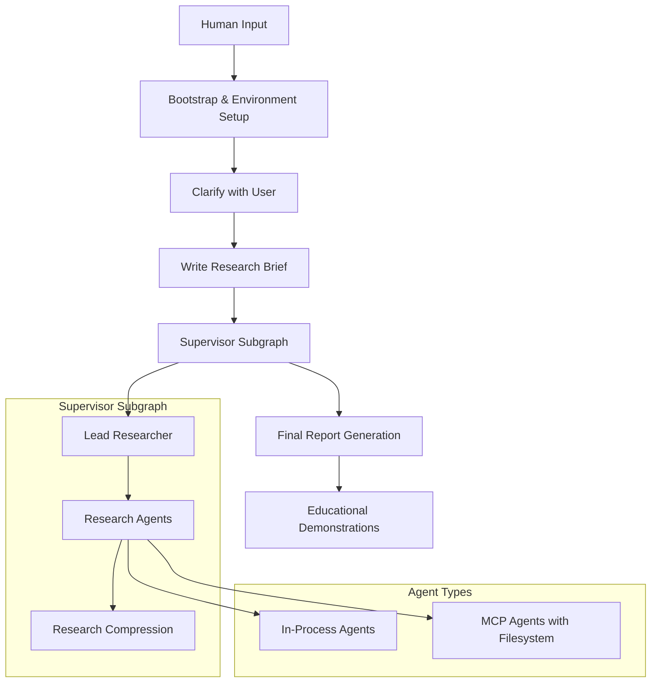

# Design Document

## Overview

The consolidated research agent notebook will provide a comprehensive, educational demonstration of the research agent framework by combining functionality from five existing notebooks into a single, well-structured workflow. The design follows the actual workflow from the existing notebooks, emphasizing educational clarity while maintaining full functionality.

## Architecture

### High-Level Flow (Based on Existing Notebooks)



### Notebook Structure (Based on 5_full_agent.ipynb)

The notebook will be organized following the actual workflow from the existing notebooks:

1. **Bootstrap Section** - Environment setup with dotenv and autoreload
2. **Framework Foundations** - Models, adapters, and basic components
3. **Template System** - Jinja prompt rendering from existing prompts.py
4. **Complete Workflow Demonstration** - The actual 5-step process:
   - Clarify with User (using clarify_with_user_instructions prompt)
   - Write Research Brief (using transform_messages_into_research_topic_prompt)
   - Supervisor Subgraph (using lead_researcher_prompt and multi-agent coordination)
   - Final Report Generation (using final_report_generation_prompt)
5. **MCP Integration** - Filesystem MCP server for local document access
6. **Educational Examples** - Component demonstrations and test alignment

## Components and Interfaces

### Core Framework Components

#### Bootstrap System

```python
# Early environment loading using environs
from environs import Env
env = Env()
env.read_env()

# Rich traceback and logging setup
import rich.traceback
rich.traceback.install()

from research_agent_framework.bootstrap import bootstrap
bootstrap()
```

#### Model Demonstrations

- **Scope**: Research topic definition with constraints
- **ResearchTask**: Individual research assignments
- **EvalResult**: Quality assessment results
- **SerpResult**: Search result normalization with raw preservation
- **Location/Address/Coordinates**: Nested geographic models
- **Rating/PriceLevel**: Business assessment models

#### LLM Client Integration

```python
# Priority order: MockLLM first for education, then real providers
from research_agent_framework.llm.client import MockLLM, OpenAIClient, AnthropicClient

# Educational examples use MockLLM for deterministic results
mock_llm = MockLLM(LLMConfig(api_key="demo", model="demo"))

# Real providers for actual research
openai_llm = OpenAIClient(OpenAIConfig(api_key=env.str("OPENAI_API_KEY")))
anthropic_llm = AnthropicClient(AnthropicConfig(api_key=env.str("ANTHROPIC_API_KEY")))
```

#### Search Adapter System

```python
# Multiple adapter types with consistent interface
from research_agent_framework.adapters.search import MockSearchAdapter, SerpAPISearchAdapter, TavilySearchAdapter

# Demonstrate from_raw construction and raw preservation
mock_adapter = MockSearchAdapter.from_raw({'provider': 'mock'})
serp_adapter = SerpAPISearchAdapter.from_raw({'provider': 'serpapi-stub'})
```

### Jinja Template System

#### Template Organization

``` bash
src/research_agent_framework/prompts/templates/
├── clarify_with_user_instructions.j2
├── research_agent_prompt.j2
├── research_agent_prompt_with_mcp.j2
├── lead_researcher_prompt.j2
├── compress_research_system_prompt.j2
├── final_report_generation_prompt.j2
├── brief_criteria_prompt.j2
└── brief_hallucination_prompt.j2
```

#### Template Renderer

```python
from research_agent_framework.prompts.renderer import render_template
from jinja2 import StrictUndefined

# StrictUndefined catches missing variables for educational clarity
rendered = render_template("clarify_with_user_instructions.j2", {
    "messages": user_messages,
    "date": get_today_str()
})
```

### Multi-Agent Workflow System

#### LangGraph Integration (Based on Existing Implementation)

```python
from langgraph.graph import StateGraph, START, END
from deep_research_from_scratch.state_scope import AgentState, AgentInputState

# Build the overall workflow (from 5_full_agent.ipynb)
deep_researcher_builder = StateGraph(AgentState, input_schema=AgentInputState)

# Add workflow nodes
deep_researcher_builder.add_node("clarify_with_user", clarify_with_user)
deep_researcher_builder.add_node("write_research_brief", write_research_brief)
deep_researcher_builder.add_node("supervisor_subgraph", supervisor_agent)
deep_researcher_builder.add_node("final_report_generation", final_report_generation)

# Add workflow edges
deep_researcher_builder.add_edge(START, "clarify_with_user")
deep_researcher_builder.add_edge("write_research_brief", "supervisor_subgraph")
deep_researcher_builder.add_edge("supervisor_subgraph", "final_report_generation")
deep_researcher_builder.add_edge("final_report_generation", END)

# Compile the full workflow
agent = deep_researcher_builder.compile()
```

#### Supervisor Architecture

```python
# Supervisor coordinates multiple specialized agents
class SupervisorAgent:
    def __init__(self, max_concurrent_agents=100):
        self.max_concurrent = max_concurrent_agents
        self.agent_pool = []
    
    async def coordinate_research(self, research_brief):
        # Spawn expert and local-expert pairs per research item
        tasks = self.decompose_research(research_brief)
        
        # Support ~100 x 2 sub-agents (expert + local-expert per item)
        agent_pairs = []
        for task in tasks[:100]:  # Limit to 100 items
            expert_agent = self.create_expert_agent(task)
            local_expert_agent = self.create_local_expert_agent(task)
            agent_pairs.append((expert_agent, local_expert_agent))
        
        # Execute research with proper concurrency management
        results = await self.execute_concurrent_research(agent_pairs)
        return self.synthesize_results(results)
```

### MCP Integration System (Based on 3_research_agent_mcp.ipynb)

#### Client Configuration

```python
from langchain_mcp_adapters.client import MultiServerMCPClient
from deep_research_from_scratch.utils import get_current_dir

# MCP server configuration for filesystem access (from existing notebook)
mcp_config = {
    "filesystem": {
        "command": "npx",
        "args": [
            "-y",  # Auto-install if needed
            "@modelcontextprotocol/server-filesystem",
            str(get_current_dir() / "files")  # Path to research documents
        ],
        "transport": "stdio"  # Communication via stdin/stdout
    }
}

# Global client variable - will be initialized lazily
_client = None

def get_mcp_client():
    """Get or initialize MCP client lazily to avoid issues with LangGraph Platform."""
    global _client
    if _client is None:
        _client = MultiServerMCPClient(mcp_config)
    return _client
```

#### Async Tool Execution

```python
# MCP requires async operations due to subprocess communication
async def execute_mcp_tools(tool_calls):
    client = get_mcp_client()
    mcp_tools = await client.get_tools()
    
    results = []
    for tool_call in tool_calls:
        if tool_call["name"] in ["read_file", "search_files", "list_directory"]:
            # MCP tools are async
            result = await tool.ainvoke(tool_call["args"])
        else:
            # Local tools may be sync
            result = tool.invoke(tool_call["args"])
        results.append(result)
    
    return results
```

#### File Operations for Report Saving

```python
# Use MCP filesystem tools to save final reports
async def save_final_report(report_content, filename):
    client = get_mcp_client()
    tools = await client.get_tools()
    write_tool = next(t for t in tools if t.name == "write_file")
    
    await write_tool.ainvoke({
        "path": f"./reports/{filename}",
        "content": report_content
    })
```

### Evaluation System

#### Quality Gates Throughout Workflow

```python
from research_agent_framework.evals import Evaluator

class WorkflowEvaluator:
    def __init__(self):
        self.evaluator = Evaluator()
    
    async def evaluate_research_brief(self, brief, user_criteria):
        # Use BRIEF_CRITERIA_PROMPT to check completeness
        criteria_eval = await self.evaluator.evaluate(
            "brief_criteria", 
            {"brief": brief, "criteria": user_criteria}
        )
        
        # Use BRIEF_HALLUCINATION_PROMPT to check for assumptions
        hallucination_eval = await self.evaluator.evaluate(
            "brief_hallucination",
            {"brief": brief, "user_input": user_criteria}
        )
        
        return criteria_eval.success and hallucination_eval.success
    
    async def evaluate_agent_research(self, research_output, task):
        # Evaluate research quality and completeness
        return await self.evaluator.evaluate(
            "research_quality",
            {"output": research_output, "task": task}
        )
    
    async def evaluate_final_report(self, report, sources):
        # Evaluate comprehensiveness and citation quality
        return await self.evaluator.evaluate(
            "report_quality",
            {"report": report, "sources": sources}
        )
```

## Data Models

### State Management

```python
from typing import TypedDict, List, Optional
from pydantic import BaseModel

# Use TypedDict for mutable agent state (as requested)
class AgentState(TypedDict):
    messages: List[str]
    research_brief: Optional[str]
    research_iterations: int
    notes: List[str]
    raw_notes: List[str]
    final_report: Optional[str]
    evaluation_results: List[dict]

# Use Pydantic models for everything else
class WorkflowConfig(BaseModel):
    max_concurrent_agents: int = 100
    max_research_iterations: int = 5
    enable_mcp: bool = True
    enable_evaluations: bool = True
    llm_provider: str = "mock"  # Start with mock for education
```

### Research Models

```python
# Enhanced models with full type safety
class Scope(BaseModel):
    topic: str
    description: str
    constraints: List[str] = []
    success_criteria: List[str] = []
    
class ResearchTask(BaseModel):
    id: str
    query: str
    context: Optional[dict] = None
    notes: List[str] = []
    agent_type: Literal["expert", "local_expert"] = "expert"
    
class EvalResult(BaseModel):
    task_id: str
    success: bool
    score: float
    feedback: str
    details: Optional[dict] = None
```

## Error Handling

### Graceful Degradation Strategy

```python
# Robust error handling with educational focus
class NotebookErrorHandler:
    def __init__(self):
        self.fallback_console = Console()
    
    def handle_import_error(self, module_name, error):
        """Handle missing dependencies gracefully"""
        self.fallback_console.print(
            f"[yellow]Note: {module_name} not available ({error}). "
            f"Using mock implementation for educational demonstration.[/yellow]"
        )
        return self.get_mock_implementation(module_name)
    
    def handle_mcp_error(self, error):
        """Fall back to in-process agents when MCP unavailable"""
        self.fallback_console.print(
            f"[yellow]MCP server unavailable ({error}). "
            f"Falling back to in-process agents.[/yellow]"
        )
        return self.get_mock_mcp_client()
    
    def handle_env_error(self, var_name):
        """Provide safe defaults for missing environment variables"""
        self.fallback_console.print(
            f"[yellow]Environment variable {var_name} not set. "
            f"Using demo value for educational example.[/yellow]"
        )
        return f"demo-{var_name.lower()}"
```

### Async Error Handling

```python
# Notebook-friendly async error handling
async def safe_async_execution(coro, fallback_value=None):
    """Execute async operations safely in notebook environment"""
    try:
        # Handle nested event loops in Jupyter
        if get_ipython() is not None:
            import nest_asyncio
            nest_asyncio.apply()
            return await coro
        else:
            return asyncio.run(coro)
    except Exception as e:
        console.print(f"[red]Async operation failed: {e}[/red]")
        return fallback_value
```

## Testing Strategy

### Test-Driven Notebook Development

```python
# Notebook cells that demonstrate test patterns
def test_model_validation():
    """Demonstrate Pydantic model validation"""
    from assertpy import assert_that
    
    scope = Scope(topic="Coffee Shops", description="Find SF coffee shops")
    assert_that(scope.topic).is_equal_to("Coffee Shops")
    assert_that(scope.constraints).is_empty()

def test_property_based_examples():
    """Show Hypothesis property-based testing"""
    from hypothesis import given, strategies as st
    
    @given(st.text(min_size=1))
    def test_mock_llm_deterministic(prompt):
        llm = MockLLM(LLMConfig(api_key="test", model="test"))
        result = asyncio.run(llm.generate(prompt))
        assert_that(result).is_equal_to(f"mock response for: {prompt}")
```

### Continuous Test Alignment

```python
# Ensure notebook examples match test suite
class NotebookTestValidator:
    def __init__(self, test_suite_path="tests/"):
        self.test_suite_path = test_suite_path
    
    def validate_example_against_tests(self, example_name):
        """Ensure notebook examples match test expectations"""
        test_file = f"{self.test_suite_path}/test_{example_name}.py"
        # Load and compare expected behavior
        return self.compare_behavior(example_name, test_file)
```

## Success Metrics

### Educational Effectiveness

- **Comprehension**: Each section builds understanding incrementally
- **Completeness**: All framework components demonstrated with working examples
- **Clarity**: Comprehensive markdown explanations and code comments
- **Consistency**: Examples align with test suite for reliability

### Technical Performance

- **Scalability**: Support for 100+ concurrent sub-agents
- **Reliability**: Graceful error handling and fallbacks
- **Maintainability**: Test-driven development with continuous validation
- **Flexibility**: Modular design allowing independent section execution

### User Experience

- **Accessibility**: Clear error messages prioritizing education over production concerns
- **Interactivity**: Human-in-the-loop clarification and feedback
- **Visibility**: Transparent workflow with visible intermediate steps
- **Practicality**: Real research capabilities alongside educational demonstrations
