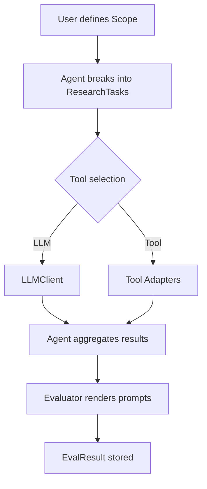
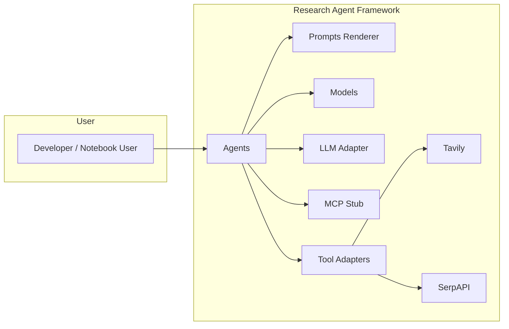
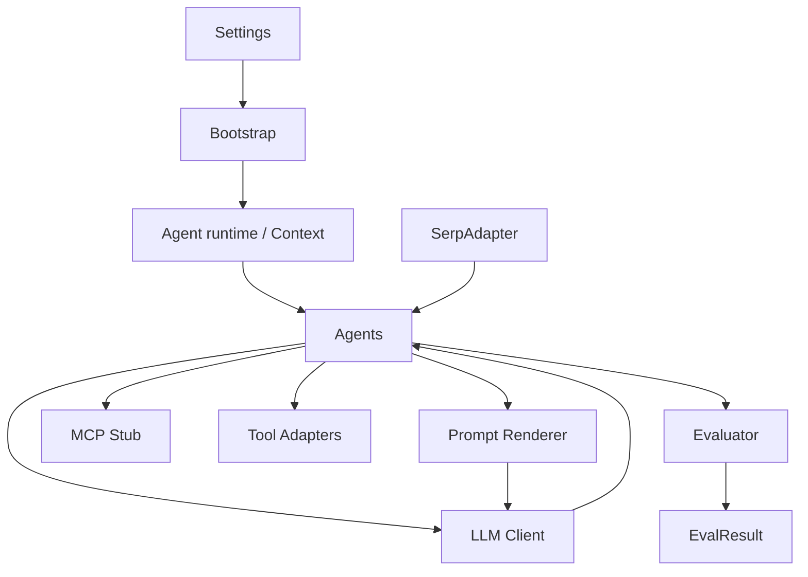

# PRD — Research Agent Framework (consolidation)

## 1. Introduction / Overview

Goal

Consolidate the five notebooks (scoping, research agents, MCP variants, supervisor, full agent) into a single, well-documented, testable
Python project that provides:

- A reusable library under `src/` implementing typed agents, prompt rendering, configuration, and adapters (LLM, MCP, Search).
- Deterministic test harnesses (MockLLM, in-process MCP stub) and unit/property tests using `pytest`, `pytest-asyncio`, `hypothesis`, and
  `faker`.
- Minimal CLI scripts (CyclOpts) and a consolidated demonstration notebook that imports the library.

Context

This PRD follows the decisions captured in `docs/prompt.md` and the user's clarifying answers. The primary audience is a software developer
implementing the project (junior-to-mid level) and the deliverable must be explicit and actionable.

## 2. Goals (measurable)

1. Provide Pydantic v2 models for core domain objects (Scope, ResearchTask, EvalResult, SerpAPI partial models) with unit tests.
2. Implement a Jinja2 prompt renderer using `StrictUndefined` and unit tests that validate error behavior when variables are missing.
3. Create `src/bootstrap.py` that runs early environment bootstrap (`environs.Env().read_env()`), installs `rich.traceback`, and configures
   `loguru` logging with sane defaults.
4. Provide MockLLM and an in-process MCP stub and at least one integration test demonstrating an agent flow with the mock stack.
5. Deliver a consolidated notebook `notebooks/0_consolidated_research_agent.ipynb` that demonstrates the end-to-end flow using the `src/`
   package.

Success criteria (short): all unit tests pass locally; the consolidated notebook runs using the mock stack without network calls; PRD saved
in `/tasks/`.

## 3. User Stories

1. As a developer, I want typed Pydantic models so I can validate inputs/outputs and write deterministic unit tests.
2. As a developer, I want a prompt renderer that fails fast on missing variables so templates don't silently produce bad prompts.
3. As a notebook user, I want a consolidated demo notebook that imports from the `src` package and runs with a MockLLM so I can reproduce
   results offline.
4. As a CI maintainer, I want tests that do not require external API keys (SerpAPI and LLM calls mocked) so CI remains reliable.

## 4. Functional Requirements (numbered)

1. The system must provide `src/config.py` exposing a `Settings` object (Pydantic v2 BaseSettings) that reads env vars via `environs` early
   in bootstrap.
2. The system must provide `src/bootstrap.py` with a `bootstrap()` function that does the early env read and installs `rich.traceback` and
   configures `loguru`.
3. The system must provide `src/prompts/renderer.py` with a `render_template(template_name: str, context: dict) -> str` helper using Jinja2
   `StrictUndefined`.
4. The system must provide `src/models.py` with Pydantic v2 models: `Scope`, `ResearchTask`, `EvalResult`, and a conservative `SerpResult`
   with `raw: dict` field.
5. The system must provide `src/llm/client.py` with an `LLMClient` Protocol and `MockLLM` implementation usable in tests.
6. The system must provide `src/mcp/stub.py` with an in-process async MCP stub that implements minimal message passing for tests.
7. The system must provide `src/agents/base.py` with an `Agent` Protocol and a `ResearchAgent` partial implementation that accepts a typed
   `context` parameter.
8. The system must include `tests/` with unit tests for models, prompt rendering, bootstrap, and at least one integration test wiring
   `MockLLM` + MCP stub.
9. The system must include a `notebooks/0_consolidated_research_agent.ipynb` that demonstrates the flow using the mock stack.
10. The system must use descriptive, Pythonic names for modules and test functions as per user preference.

## 5. Non-Goals (Out of Scope)

1. Running or configuring a production LangGraph/ LangChain MCP server. Only adapters and an in-process stub are required for v1.
2. Shipping paid API keys or running live SerpAPI/LLM calls in CI. Local real-key runs are allowed with a `.env` file but not required.
3. UI beyond the notebook and minimal CLI scripts (no web UI, no mobile UI in v1).
4. Extensive optimization or performance tuning — aim for clarity and correctness.

## 6. Design Considerations

- Use `environs.Env().read_env()` in `bootstrap()` and ensure `bootstrap()` is called as early as possible in notebooks and scripts.
- Prompt templates (based on the current prompts located in `src\deep_research_from_scratch\prompts.py`) are Jinja `.j2` files stored under
  `src/prompts/templates/` and referenced by logical names.
- Use `StrictUndefined` in the renderer to surface missing variables as errors.
- Use `loguru` for logging with a simple `logger.configure` that can be overridden via `Settings`.
- Tests use `pytest` and `pytest-asyncio`. Where property testing is useful, add `hypothesis` tests in `tests/`.

### Diagrams (Mermaid)

Flow (research task lifecycle):

C4 Context (system boundaries):

High-level Architecture (components and data flow):

## 7. Technical Considerations

- Target Python 3.12+.
- Use Pydantic v2 with `pydantic-settings` for `Settings`.
- Keep external runtime dependencies minimal; prefer lightweight dev/test-only deps for deterministic runs (MockLLM is in-repo).
- Use `environs` as the canonical env loader and bootstrap mechanism (`environs.Env().read_env()`). Do not add `python-dotenv` compatibility
  for v1; consider as vNext if requested.
- For search adapters (e.g., SerpAPI, Tavily, Jina Reader), provide conservative Pydantic models where appropriate with a `raw: dict`
  fallback and a `from_raw(raw: dict)` factory. Group adapters under `src/adapters/search/` or `src/tools/` with a shared interface.

## 8. Success Metrics

- Unit tests (model validation, renderer behavior) are prioritized and must be run locally by developers before check-in. Aim for high
  coverage for core modules; a strict CI coverage gate is not required for this experimental project.
- Integration tests using MockLLM + MCP stub are optional for CI; running them locally is sufficient for the early iterations.
- Consolidated notebook runs end-to-end locally without network calls.

## 9. Next Steps

- Implement core files in the planned order prioritizing unit tests for models and the prompt renderer. Follow incremental UT-driven
  development; devs run tests locally before committing.
- Create `notebooks/0_consolidated_research_agent.ipynb` that imports and demonstrates the mock-driven flow; the notebook is the primary UI
  for exercising the framework and will be updated incrementally.
- De-prioritize MCP adapters for v1; focus work on scope, evals, supervisor, and full-agent in that order.
- Iterate on the PRD if you want naming or scope changes.

---

Saved to `tasks/prd-research-agent-framework.md`.
